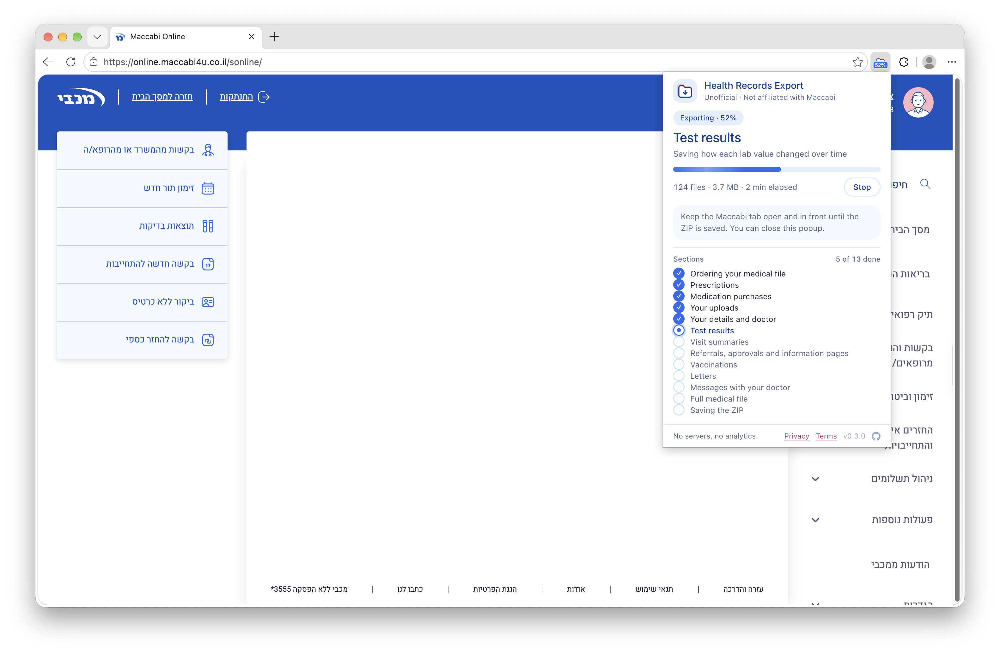
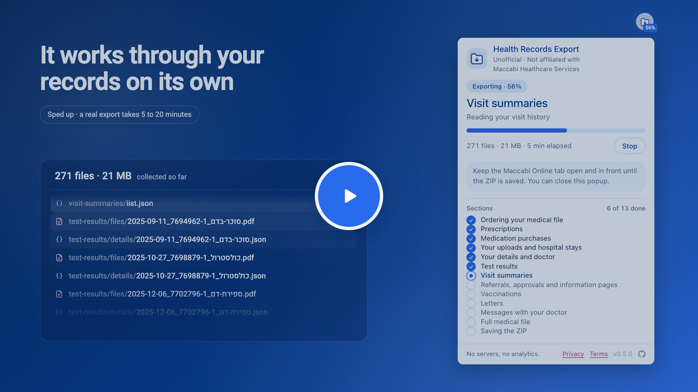
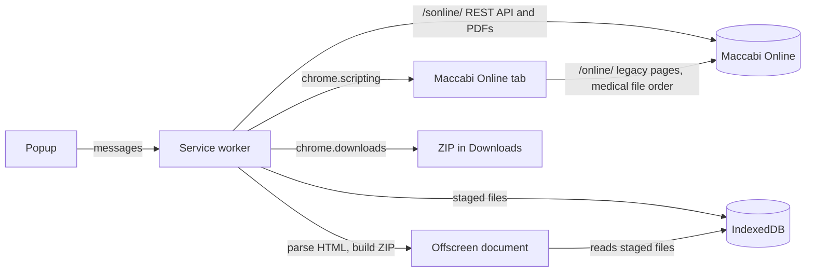

# Health Records Export for Maccabi

Ask an AI assistant about your [Maccabi Online](https://online.maccabi4u.co.il) medical records, in plain language
and in the language you speak. This Chrome extension saves them to your computer as one ZIP file, every PDF the site
offers plus the site's own data as JSON, and you open the folder in the assistant you choose.

Maccabi Online shows your records one section and one PDF at a time, and its medical-file form covers less than your
whole history. The export gathers everything in one go, with a freshly ordered medical file that reaches back to your
earliest visit. It helps you understand your records and prepare for your doctor. It doesn't replace your doctor.

> [!NOTE]
> Unofficial. Not affiliated with, endorsed by or sponsored by Maccabi Healthcare Services.

<p align="center">
  <a href="https://chromewebstore.google.com/detail/lmjcbhajlnbpldofejcglcdclceampjp">
    
  </a>
</p>

<p align="center">
  
</p>

<p align="center">
  <a href="https://youtu.be/IyP4kBFQHJQ">
    
  </a>
</p>

<p align="center">
  ▶︎ <a href="https://youtu.be/IyP4kBFQHJQ">Watch an export, start to finish</a> · 1 minute, narrated
</p>

- **Ready for your AI assistant.** Open the folder in Claude Cowork, Claude Code, ChatGPT Work or Codex, and the
  ZIP's `README.md` becomes the assistant's instructions for your records. Assistants that connect to medical records
  reach U.S. providers, not Maccabi Healthcare Services; this is how yours get to one. See
  [Hand it to an AI assistant](#hand-it-to-an-ai-assistant).
- **In your language.** The records are mostly in Hebrew. Ask about them, and get answers, in English or whatever you
  speak.
- **Thorough.** Test results, visit summaries, prescriptions and purchases, referrals, vaccinations, letters, doctor
  inquiries, saved documents and hospital stays, plus a freshly ordered copy of your full medical file. Some things
  [aren't included](#not-included).
- **Private.** Your records stop at your computer, and you choose which assistant, if any, reads them. Talks only to
  `online.maccabi4u.co.il`. No servers, no analytics, no remote code. Never sees your password.
- **Raw.** One JSON file per record, exactly as the site sent it, named so you can read it: `<date>_<id>_<title>`,
  with a `README.md` in the ZIP explaining the lot.
- **Resumable.** If your session ends partway through, log in again and press **Resume**. Files collected so far
  are kept.

[Install](#install) · [Export your records](#export-your-records) · [What's in the ZIP](#whats-in-the-zip) ·
[Privacy and safety](#privacy-and-safety) · [Development](#development)

## Install

You need Chrome 116 or newer.

**[Install from the Chrome Web Store](https://chromewebstore.google.com/detail/lmjcbhajlnbpldofejcglcdclceampjp)**, and
Chrome keeps it up to date. However you install it, the build isn't minified, so you can read exactly the code that
runs.

### Load it unpacked instead

1. Download `health-records-export-for-maccabi-<version>.zip` from the
   [latest release](https://github.com/RoniRachmani/health-records-export-for-maccabi/releases/latest) and unzip it.
2. Open `chrome://extensions` and turn on **Developer mode**.
3. Click **Load unpacked** and select the unzipped folder, the one with `manifest.json` in it. Keep the folder: Chrome
   loads the extension from it.

Chrome doesn't update an unpacked extension. To move to a newer one, download it again over the same folder and press
the reload arrow on `chrome://extensions`. Finish or stop an export first: a reload ends it.

### Build from source

You need Node.js 22 or newer.

```sh
git clone https://github.com/RoniRachmani/health-records-export-for-maccabi.git
cd health-records-export-for-maccabi
npm install
npm run build
```

Then load the `dist/` folder the same way.

## Export your records

1. Log in to Maccabi Online as usual.
2. On that tab, click the extension's icon and press **Start export**. The first time, read the notice and press
   **Agree and continue**. Nothing is read from the tab until you do.
3. Leave the tab open and in front. It starts on the old site's medical-file page, to order your file and collect the
   parts that live there, then returns to the new site for the rest. The toolbar badge shows progress.
4. After 5 to 20 minutes, `maccabi-export-YYYY-MM-DD.zip` is in your Downloads folder and Chrome notifies you.
5. Unzip it, open the folder in your AI assistant and ask about your records. See
   [Hand it to an AI assistant](#hand-it-to-an-ai-assistant).

### Before you start

- **Maccabi Healthcare Services will text you, right at the start.** Each export orders a fresh copy of your full medical file, first
  thing, so Maccabi Healthcare Services can build it while everything else is collected. It sends the site's own order request, but asks
  for your whole history, which is wider than the range the site's form offers. Maccabi Healthcare Services sends an SMS, and the new file
  replaces the previous one on the site. A copy ordered earlier the same day over the same range is used as it is.
  This is the only change the extension makes to your account, and it happens even if the export later fails.
- **Keep the Maccabi Online tab in front.** Chrome pauses hidden tabs, which can end your session. If you switch away, the
  export waits until you come back.
- **Your session is kept awake.** Maccabi Healthcare Services logs you out after six minutes without a click or a keypress on the page, and
  an export asks nothing of you for far longer than that, so while it runs the extension signals activity in that tab
  every few minutes. It stops as soon as the export does.

### If something goes wrong

| The popup says | What to do |
|---|---|
| **Export paused** | Your session ended. Log in to Maccabi Online again, click the icon on that tab and press **Resume**. (The extension first tries to reconnect by itself.) Also shown after Chrome restarts mid-export. |
| **Waiting for the Maccabi Online tab** | Bring the tab back to the front. The export continues on its own. |
| **Export stopped** | Press **Try again** on the Maccabi Online tab. It continues from the step that failed. |
| **The ZIP was not saved** | Press **Save again**. |

Resume refuses to continue if a different member is logged in. **Stop** ends the export and deletes the files collected
so far.

A single item that fails doesn't stop the export. It's listed in the popup when the export finishes, and stays
there until the next export starts.

## What's in the ZIP

One folder, `maccabi-export-YYYY-MM-DD/`:

| Folder | Contents |
|---|---|
| `profile/` | Member details, entitlements, insurance seniority, your doctors' provider details |
| `my-doctor/` | Assigned doctors and eligibilities |
| `test-results/` | Test list, each result, a history per lab measurement, latest lab results, result PDFs |
| `visit-summaries/` | Visits of the last 12 months and their summary PDFs |
| `medications-and-prescriptions/` | Prescriptions and their PDFs, full purchase history, purchase report PDF |
| `referrals/` | Referrals and their PDFs |
| `approvals/` | Approvals and their PDFs |
| `info-pages/` | Information pages from your visits, and their PDFs |
| `vaccinations/` | Vaccinations by group, flu vaccine eligibility, vaccination booklet PDF |
| `letters/` | Letters and their PDFs |
| `communication-with-doctor/` | Inquiries to doctors and attached forms |
| `uploads/` | Documents you uploaded and their files |
| `hospital-stays/` | Hospital visits: date, kind of visit, hospital and department, and discharge letters when the site has them. Only when the site lists any |
| `allergies-sensitivity/`, `appointments/` (future only), `requests-approvals/` | Only when the site has something in them |
| `<date>_medical-file.pdf` | Your full medical file, freshly ordered: one document covering your whole history, and the place to start |
| `README.md` | Instructions for an AI assistant, and the export's own data dictionary: what each folder holds, how a record is shaped, which fields carry no meaning, and what the export does **not** contain |
| `CLAUDE.md`, `AGENTS.md` | Point Claude Code and Codex at `README.md`, so they take it as their instructions without being told to |

Every section keeps its list in `list.json`, one JSON file per record in `details/`, and documents in `files/`.

Files are named `<date>_<id>_<title>`, so a record's JSON and its PDF share a name:

```
visit-summaries/list.json
visit-summaries/details/2026-02-01_A1_קרדיולוגיה.json
visit-summaries/files/2026-02-01_A1_קרדיולוגיה.pdf
```

The date and id come from the record; the title is a display string the site returned, used as it sent it and left
out when a record has none.

> Hebrew names are flagged UTF-8 in the ZIP, so Finder, Windows Explorer and 7-Zip read them correctly. macOS's
> bundled `unzip` command is Info-ZIP 6.00, which predates that flag and garbles them — use `ditto -x -k <zip> <dir>`
> there instead.

`README.md` is written for whoever reads the export next, most often an AI assistant (see
[Hand it to an AI assistant](#hand-it-to-an-ai-assistant)). It opens with how to work with the records, then points
at your full medical file PDF as the one document to start from, then says what the export doesn't contain — no DICOM images, no visit
data over 12 months — so a reader doesn't take an omission for an absence in your history. It then goes folder by
folder, and through the values that mislead: a lab `result` of 0 that is really a text answer, placeholder dates,
and fields that change on every request. It shares a reader's context with the records themselves, so it is kept
to what the files don't say for themselves, and the field names are left to the JSON.

Each JSON file is the site's response as sent, wrapped with where it came from. Your member ID is never written into
file paths or `endpoint` values:

```json
{
  "endpoint": "GET MainAppAPI/v1/members/0/{mid}",
  "fetched_at": "2026-09-17T08:12:03.512Z",
  "status": 200,
  "data": { "...": "the response, unchanged" }
}
```

Two exceptions: `medications-and-prescriptions/purchased-history.html` is the site's purchase table as sent
(windows-1255; the site has no JSON version of it), and the two report files leave out the base64 PDF, which is saved
in `files/` instead — those say so in their own `omitted` field.

[docs/endpoints.json](docs/endpoints.json) maps every request to the file it produces.

### Not included

- **Imaging studies (DICOM).** The site only opens them in its viewer. Export them by hand from there.
- **Visits older than 12 months.** The site doesn't show them.
- **Older purchase reports.** The purchase report PDF covers the last 2 years. The purchase history covers everything.

### Hand it to an AI assistant

The export is made to be worked on with an AI assistant. Assistants that connect to medical records reach U.S.
providers, not Maccabi Healthcare Services, so this export is how your records get to one. Unzip it and open the folder in Claude Cowork, Claude Code,
ChatGPT Work or Codex: `README.md` is the assistant's saved instructions, and the records are its project files.
Claude Code reads `CLAUDE.md` and Codex reads `AGENTS.md` on their own, and both lead to `README.md`; elsewhere, add
`README.md` as the project's instructions, or ask the assistant to read it first.

What it helps you do:

- **See your whole history.** The full medical file reaches back to the earliest visit on record, far beyond the
  few years the site's data covers.
- **Ask in your own language.** The records are mostly in Hebrew; ask, and get answers, in English or whatever you
  speak.
- **Track changes over time.** Each lab measurement has its own history, often years long.
- **Prepare for your next visit.** Known problems, the latest results, recent visits and open referrals, in one place.
- **Check every answer.** The assistant is asked to name the file, and the page of a PDF, behind each fact.

It supports your doctor and doesn't replace them. For urgent symptoms, call a doctor or emergency services, not an
assistant.

Things to ask (the first is a good place to start):

- *Summarize my health history from my full medical file.*
- *Help me understand my latest blood test.*
- *How has my HbA1c changed over the years?*
- *What should I raise at my next appointment?*
- *Translate my latest letter from the clinic into English.*
- *Which referrals and approvals are still open?*
- *What did the cardiologist write at my last visit?*
- *When was my last tetanus shot?*
- *Which medications have I bought this year, and how often?*
- *Make a one-page summary to bring to a new doctor.*

The instructions are the assistant's guardrails. They ask it to start from your full medical file, to say which file
(and which page of a PDF) each fact comes from and give it a date, to write its own notes into a new folder rather than
change the export, and to keep your name, ID number and contact details out of web searches and other tools unless you
ask. They have it say plainly when a record suggests something needs a doctor soon, and explain in plain language
rather than diagnose, and they say where to look for the common questions: a lab value's trend, the latest results,
what changed since your last visit, what to raise at an appointment, your allergies.

> [!WARNING]
> The extension sends your records nowhere, but an AI service you open them in can read them. Before you give it your
> health information, check what it keeps and for how long. Where the service lets you, turn off training on your
> chats, keep each person's records in a project of their own with memory kept to that project, and delete the
> project when you're done with it.

**What about ChatGPT Health?** As of September 2026, OpenAI offers Health in ChatGPT to users in the U.S., and it
connects medical records from U.S. providers only, so it can't reach Maccabi Healthcare Services. Open the export in ChatGPT Work, or in
any of the assistants above, instead.

## Privacy and safety

- The extension communicates only with `online.maccabi4u.co.il`. It has no servers, analytics or tracking, and no
  remote code.
- It never sees, stores or enters your password or one-time codes. It uses the session you're already logged in with.
  The session token is kept in Chrome's in-memory session storage and never written to disk.
- Collected files are staged in the extension's IndexedDB and deleted as soon as the ZIP is saved, or when you stop
  the export.
- Apart from the medical file order, it only reads. Requests go one at a time, 300 ms apart — a few hundred over an
  export, more for a long history — and all of them are listed in [docs/endpoints.json](docs/endpoints.json). It never
  calls anything that changes or deletes data, marks items as read, returns session credentials, or touches payment
  details.
- If Maccabi Healthcare Services answers 429, the extension waits exactly as long as the response asks and tries once more. If Maccabi Healthcare Services
  asks again, or asks for a wait longer than two minutes, the export stops rather than keep knocking. Files collected
  so far are kept, so you can try again later.

> [!WARNING]
> The ZIP isn't encrypted. Anyone who can open it can read your health information. Keep it somewhere safe, and take
> care when you share it.

Read the full [Privacy Policy](docs/privacy.md) and [Terms of Use](docs/terms.md).

### Permissions

| Permission | Used to |
|---|---|
| `online.maccabi4u.co.il` | Read your records from the site you're logged in to. No other sites. |
| `scripting` | Read the login session from the Maccabi Online tab, and send the requests the site accepts only from its own pages |
| `downloads` | Save the ZIP |
| `storage`, `unlimitedStorage` | Keep export progress, and collected files until the ZIP is saved (PDFs can be large) |
| `offscreen` | Build the ZIP, and parse two HTML tables the site returns |
| `alarms` | Continue a long export if Chrome suspends the extension's background worker |
| `notifications` | Tell you when the export is ready or needs you |

## Development

[](https://github.com/RoniRachmani/health-records-export-for-maccabi/actions/workflows/ci.yml)

You need Node.js 22 or newer and Chrome.

```sh
npm install
npm test               # unit tests (synthetic data only)
npm run typecheck
npm run dev            # development build in dist-dev/, rebuilt on change
npm run build          # store build in dist/
```

Load `dist-dev/` at `chrome://extensions` the same way as `dist/`. It shows up as
"Health Records Export for Maccabi (dev)".

### How it works



The service worker walks a fixed plan (`PLAN` in `src/extension/shared/state.ts`): one crossing to the old site to
order the medical file and collect purchases, hospital stays and uploads (with the member's details and prescriptions,
which the REST API answers from any page), back to `/sonline/` for the other REST API sections, and the medical file collected last, by which time Maccabi Healthcare Services has had the whole run to build it. Each finished step is
checkpointed in `chrome.storage.local`, so a paused run, or a restarted service worker, continues from there.

The tab visits a single legacy page, `/online/medicalfile/summary/`. The legacy services answer only after some
`/online/` page has been loaded in the session, and the medical file order has to be sent from that one, so the four
steps that need the old site share it. The run returns to `/sonline/` before waiting for the medical file: the site
renews the session token only there, and the wait is the longest part of the run.

REST API requests (`/sonline/`) go from the service worker, with the session token read from the tab. Legacy requests
(`/online/`) and the medical file order go from inside the Maccabi Online tab, where the site requires them to originate.

| Path | Contents |
|---|---|
| `src/core/` | The collection logic, one file per part of the site in `sections/`. Uses no extension APIs: it reaches the site through a `Transport`, writes through a `Sink` and parses HTML through an `HtmlParser` (see `types.ts`). |
| `src/extension/background/` | The service worker: the run loop with pause and resume (`runner.ts`), the Maccabi Online tab (`tab.ts`), badge and notifications (`ui.ts`) |
| `src/extension/offscreen/` | HTML parsing and ZIP building, which the service worker can't do |
| `src/extension/shared/` | Run state and plan, IndexedDB staging, the ZIP's layout and the `README.md` written into it |
| `src/extension/popup/` | The popup |
| `src/extension/dev/` | The bridge content script, injected by the development build only |
| `test/` | Vitest tests against a fake Maccabi Online (`fakes.ts`) |
| `docs/` | Endpoint map, privacy policy, terms, store listing; the README's images in `images/` |
| `public/` | Icons, and the privacy policy, terms and third-party notices that ship in the extension |
| `store/` | Chrome Web Store images in `assets/`, and the pages they're rendered from in `src/` |
| `scripts/` | Build scripts: icons, store images and video, the release ZIP |
| `.github/` | The CI workflow that runs the gate, the issue forms, the security policy, and Dependabot |

### The look

The popup and the pages that ship with it share one design system: navy headings over white, one bright blue
for actions and progress, magenta for links, pale-blue cards at a 20px radius, pill buttons, and a soft
navy-tinted shadow. The register is meant to feel at home next to Maccabi Online rather than foreign to it, while
staying plainly the extension's own — there is no Maccabi Healthcare Services logo or wordmark anywhere, and the header says
"Unofficial · Not affiliated with Maccabi Healthcare Services" on every screen.

The stylesheets ask for Roboto first and fall back to the system face. That is a local lookup only: the extension
ships no fonts and downloads none.

The tokens live at the top of `src/extension/popup/popup.css`, with `public/pages.css` repeating the ones the privacy,
terms and AI assistant pages need (`public/` is copied verbatim, so it cannot import them). Both pin `color-scheme: light` —
there is no dark theme, and pinning it keeps Chrome's auto-dark-mode from repainting controls and scrollbars
against a light page. Every text colour meets WCAG AA on the surface it sits on. Chrome caps a popup at 600px
tall, so keep the states that are not disclosures under it; `npm run store-assets` re-renders the store images.

### Driving a run from the console

The development build adds a bridge content script, so you can run and inspect an export from the Maccabi Healthcare Services page's
DevTools console:

```js
const dev = (msg) => new Promise((ok) => { const id = Math.random(); addEventListener('message', function f(e) { if (e.data?.__hremDev === 'res' && e.data.id === id) { removeEventListener('message', f); ok(e.data.res); } }); postMessage({ __hremDev: 'req', id, msg }, '*'); });

await dev({ type: 'dev:state' });
await dev({ type: 'dev:stopBefore', step: 'orderMedicalFile' });   // test a full run without ordering
```

| Command | Does |
|---|---|
| `dev:state` | Run state, staged files per folder, token status |
| `dev:start`, `dev:resume`, `dev:cancel`, `dev:dismiss`, `dev:retrySave` | What the popup's buttons do |
| `dev:problems` | Items that failed so far |
| `dev:titleFields` | Which response fields hold a display string, and in which language. Field names only. |
| `dev:stopBefore` `{step}` | Pause before a plan step. Without `step`, clears it. |
| `dev:breakSession` | Invalidate the stored token, to test reconnecting |
| `dev:rawDump` `{on}` | Stage every response of the next run under `_raw/` in the ZIP, byte for byte, beside the export. Set it before `dev:start`. |
| `dev:routes` `{routes}` | Choose whether `/sonline/` and `/online/` requests go from the extension or the tab |
| `dev:spike` `{url, method, route, auth}` | Send one request and report its status and shape |
| `dev:reload` | Reload the extension |

Replies carry statuses, sizes and counts, never record contents. None of this is in the store build.

### Releasing

```sh
npm run package        # release/health-records-export-for-maccabi-<version>.zip for the Chrome Web Store and GitHub release
npm run store-assets   # store/assets/ screenshots, promo tiles and the video's poster (needs Chrome, Chromium or Edge; set CHROME_PATH if not found)
npm run store-video    # store/assets/promo-video.mp4, the promo video (same browser; ffmpeg if you have it)
npm run icons          # public/icons/ and store/assets/icon-128.png
```

`package` builds `dist/` first, and refuses a development build. The store images and the video show the real
popup with made-up states. [docs/store-listing.md](docs/store-listing.md) has everything to fill in on the store
dashboard.

The video is drawn frame by frame in the same headless browser (`store/src/video.ts`), so nothing depends on the
speed of the machine rendering it: the export it plays is the real popup, driven through a whole run by states
built from the real plan and its weights. It comes out in 4K at 60 fps — the 1920×1080 stage drawn at twice its
size — and each frame is piped straight into the encoder: `ffmpeg` when that is on `PATH`, and otherwise, on
macOS, `scripts/encode-mp4.swift`, compiled on the spot. A full render takes about 20 minutes; give two times in
seconds to render one part of it while working on it, e.g. `npm run store-video -- 8 12`.

Its soundtrack is scored from the same timeline by `scripts/soundtrack.mjs`: music and effects synthesized there,
from oscillators and noise, and narration spoken by ElevenLabs (`scripts/narration.mjs`). The voice comes from one
take of the whole script, made in ElevenLabs with the text `--script` prints and brought in with
`--import <take>`, which cuts it into lines at the pauses; or, with `ELEVENLABS_API_KEY` in the environment or a
gitignored `.env`, line by line over the API. Spoken lines are cached in `.cache/narration/`, so only a changed
line costs anything. `--audio-only` writes the soundtrack alone, to listen to; `--remux` puts a changed soundtrack
on the last render's picture in seconds, without drawing it again; `--no-narration` leaves the voice out, and
`--silent` the sound. The MP4 is not committed — the store's video
field takes a YouTube link, so upload it there and paste the link on the dashboard. The poster above it is one frame of the same
film, drawn by the same page: `npm run store-assets -- poster`.

### Ground rules

- **Never commit real data.** No responses, exports, PDFs or anything else taken from a real account. Test fixtures are
  synthetic.
- **List every request in [docs/endpoints.json](docs/endpoints.json).** The privacy policy and the store review rely on
  it being complete.
- **Keep the policies in sync.** `docs/privacy.md` goes with `public/privacy.html`, and `docs/terms.md` with
  `public/terms.html`. Change the effective date when you change either. For a material change, also set
  `TERMS_EFFECTIVE` in `src/extension/shared/state.ts` to the new date, so the popup asks users to accept again.
  Likewise *Hand it to an AI assistant* above goes with `public/ai-assistant.html`, the page the popup's "See how" opens.
- **Keep [public/third-party-notices.txt](public/third-party-notices.txt) current.** It carries the licenses of
  third-party code bundled into the package (fflate, and Vite's module preload polyfill). Update it when a runtime
  dependency is added or upgraded.
- **Regenerate the store images** with `npm run store-assets` when the popup changes.

## Issues

Report bugs in [GitHub Issues](https://github.com/RoniRachmani/health-records-export-for-maccabi/issues). Issues are
public: never include health information, your ID number or files from an export.

## License

[MIT](LICENSE).

The extension copies what Maccabi Online provides and doesn't interpret it. It isn't medical advice or an official
copy of your records. See the [Terms of Use](docs/terms.md).
