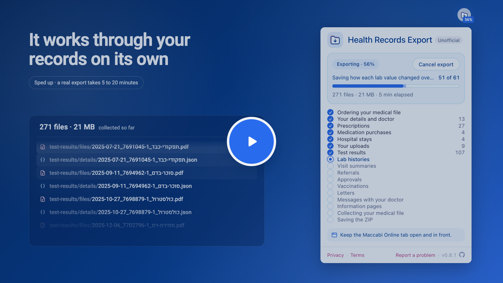
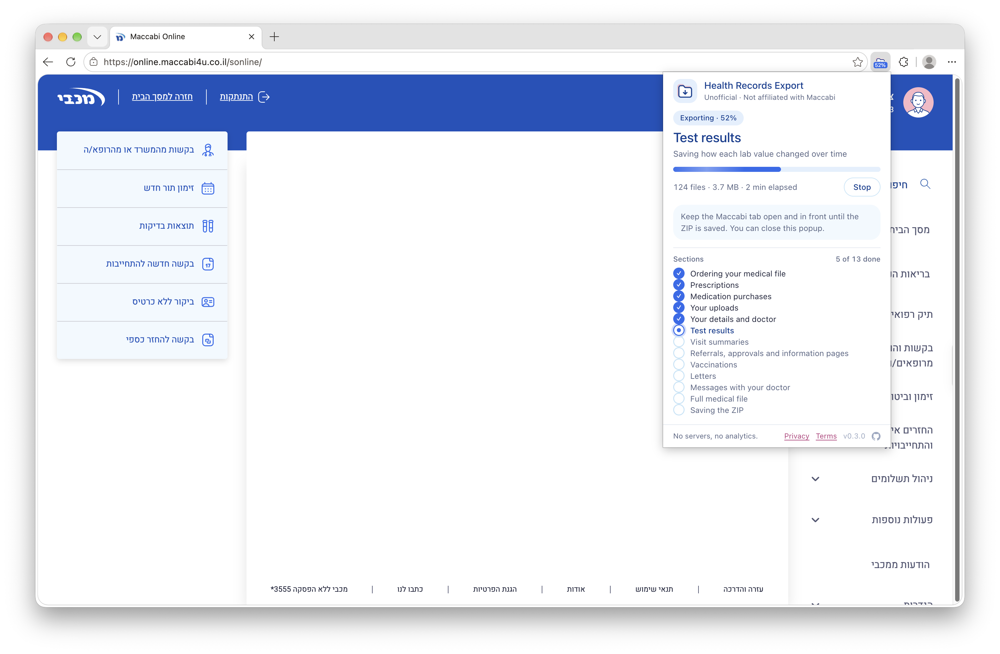
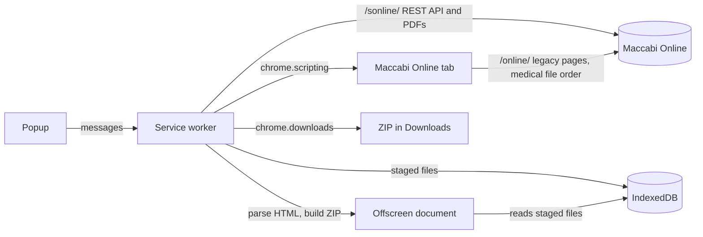

# Health Records Export for Maccabi

**Your whole Maccabi history, and a genius friend who's read all of it.**

Save everything from [Maccabi Online](https://online.maccabi4u.co.il) to your computer, then ask anything: what
changed, what stands out, what to do next. This Chrome extension saves every record the site has, and every PDF, as one
ZIP, and you open the folder in the Claude or ChatGPT desktop app. It's free, and your records stay on your computer.

Maccabi Online shows your records one page at a time, within date limits, and the AI health tools that connect to
medical records reach only U.S. providers. The export puts every record in one place, where an assistant can read all
of it.

> [!NOTE]
> Unofficial. Not affiliated with, endorsed by or sponsored by Maccabi Healthcare Services.

<p align="center">
  <a href="https://chromewebstore.google.com/detail/lmjcbhajlnbpldofejcglcdclceampjp">
    
  </a>
</p>

<p align="center">
  Website: <a href="https://maccabi.ronirachmani.com/">maccabi.ronirachmani.com</a>
</p>

<p align="center">
  <a href="https://maccabi.ronirachmani.com/#ask">
    
  </a>
</p>

<p align="center">
  <a href="https://maccabi.ronirachmani.com/#ask">What to ask your AI assistant</a>, and <a href="https://maccabi.ronirachmani.com/ai-assistant.html">where to open your export</a> · every record in the picture is made up
</p>

- **Everything, in one place.** Your full medical file, ordered for the widest range Maccabi allows, plus every result,
  visit, prescription, referral, vaccination and letter the site has, including what its own screens cut off. Some
  things [aren't included](#not-included).
- **A friend who's read it all.** Ask what stands out, what changed in your latest blood test, or what to raise with
  your doctor on Thursday. It reads the Hebrew, answers in plain English, and names the record behind every answer, so
  you can check it. It advises; you and your doctor decide.
- **Yours to keep, and to grow.** Take it to a private doctor or one abroad, and keep it through a move or a switch of
  health fund. Add to it as you go (a private clinic's letter, a new result, notes from abroad), and it becomes a health
  record you keep, not a one-time snapshot.

<p align="center">
  <a href="https://youtu.be/tfTOSfOnCm4">
    
  </a>
</p>

<p align="center">
  ▶︎ <a href="https://youtu.be/tfTOSfOnCm4">Watch an export, start to finish</a> · 1 minute, narrated
</p>

Under the hood, each record is the site's own JSON, exactly as it was sent, beside its PDF and named so you can read it:
`<date>_<id>_<title>`. If your session ends partway through, log in again and press **Resume**: files collected so far
are kept. The extension talks only to `online.maccabi4u.co.il`, has no servers or analytics, and never sees your
password.

[Install](#install) · [Export your records](#export-your-records) · [What's in the ZIP](#whats-in-the-zip) ·
[Privacy and safety](#privacy-and-safety) · [Development](#development)

## Install

You need Chrome 116 or newer.

**[Install from the Chrome Web Store](https://chromewebstore.google.com/detail/lmjcbhajlnbpldofejcglcdclceampjp)**, and
Chrome keeps it up to date. However you install it, the build isn't minified, so you can read exactly the code that
runs.

### Load it unpacked instead

1. Download `health-records-export-for-maccabi-<version>.zip` from the
   [latest release](https://github.com/RoniRachmani/health-records-export-for-maccabi/releases/latest) and unzip it.
2. Open `chrome://extensions` and turn on **Developer mode**.
3. Click **Load unpacked** and select the unzipped folder, the one with `manifest.json` in it. Keep the folder: Chrome
   loads the extension from it.

Chrome doesn't update an unpacked extension. To move to a newer one, download it again over the same folder and press
the reload arrow on `chrome://extensions`. Finish or stop an export first: a reload ends it.

### Build from source

You need Node.js 22 or newer.

```sh
git clone https://github.com/RoniRachmani/health-records-export-for-maccabi.git
cd health-records-export-for-maccabi
npm install
npm run build
```

Then load the `dist/` folder the same way.

## Export your records

1. Log in to Maccabi Online as usual.
2. On that tab, click the extension's icon and press **Start export**. The first time, read the notice and press
   **Agree and continue**. Nothing is read from the tab until you do.
3. Leave the tab open and in front. It starts on the old site's medical-file page, to order your file and collect the
   parts that live there, then returns to the new site for the rest. The toolbar badge shows progress.
4. Usually after a few minutes (up to 20 if the medical file is slow to arrive), `maccabi-export-YYYY-MM-DD.zip` is in your Downloads folder and Chrome notifies you.
5. Unzip it, open the folder in the Claude or ChatGPT desktop app and ask. See
   [Hand it to an AI assistant](#hand-it-to-an-ai-assistant).

<p align="center">
  
</p>

### Before you start

- **Maccabi Healthcare Services will text you, right at the start.** Each export orders a fresh copy of your full medical file, first
  thing, so Maccabi Healthcare Services can build it while everything else is collected. It sends the site's own order request, but asks
  for your whole history, which is wider than the range the site's form offers. Maccabi Healthcare Services sends an SMS, and the new file
  replaces the previous one on the site. A copy ordered earlier the same day over the same range is used as it is.
  This is the only change the extension makes to your account, and it happens even if the export later fails.
- **Keep the Maccabi Online tab in front.** Chrome pauses hidden tabs, which can end your session. If you switch away, the
  export waits until you come back.
- **Don't log in to Maccabi Online anywhere else while it runs.** Maccabi keeps one session per member, so logging in
  from another browser or computer ends the one the export is using.
- **Your session is kept awake.** Maccabi Healthcare Services logs you out after five and a half to six minutes without a click or a keypress on the page,
  and an export asks nothing of you for far longer than that, so while it runs the extension signals activity in that
  tab every few minutes, in the form each of the site's pages listens for. If the export pauses because you switched away, it also sends the site's own keep-alive request every few
  minutes, since the site ends a session after 6 to 8 minutes without one. It stops as soon as the export does.

### If something goes wrong

| The popup says | What to do |
|---|---|
| **Export paused** | Your session ended. Logging in to Maccabi Online anywhere else (another browser or computer) does this: Maccabi keeps one session per member. Log in to Maccabi Online again, click the icon on that tab and press **Resume**. (The extension first tries to reconnect by itself.) Also shown after Chrome restarts mid-export. |
| **Waiting for the Maccabi Online tab** | Bring the tab back to the front. The export continues on its own. |
| **Export stopped** | Press **Try again** on the Maccabi Online tab. It continues from the step that failed. |
| **The ZIP was not saved** | Press **Save again**. |

Resume refuses to continue if a different member is logged in. **Cancel export** ends the export and deletes the files
collected so far, once you confirm it.

A single item that fails doesn't stop the export. It's listed in the popup when the export finishes, and stays
there until the next export starts. The ZIP records it too, in `export-errors.json`, so whoever reads the export
later can tell a section that failed from one that had nothing in it.

## What's in the ZIP

One folder, `maccabi-export-YYYY-MM-DD/`:

| Folder | Contents |
|---|---|
| `profile/` | Member details, entitlements, insurance seniority, your doctors' provider details |
| `my-doctor/` | Assigned doctors and eligibilities |
| `test-results/` | Test list, each result, a history per lab measurement, latest lab results, result PDFs |
| `visit-summaries/` | Visits of the last 12 months, and older ones that answered an inquiry to your doctor, with their summary PDFs |
| `medications-and-prescriptions/` | Prescriptions and their PDFs, full purchase history, purchase report PDF |
| `referrals/` | Referrals and their PDFs |
| `approvals/` | Medical certificates, approvals and specialists' answers to your doctors, and their PDFs |
| `info-pages/` | Information pages from your visits, and their PDFs. Only when the site lists any |
| `vaccinations/` | Vaccinations by group, flu vaccine eligibility, vaccination booklet PDF |
| `letters/` | Letters and their PDFs |
| `communication-with-doctor/` | Inquiries to doctors and attached forms, each pointing to the visit it was answered in |
| `uploads/` | Documents you uploaded and their files |
| `hospital-stays/` | Hospital visits: date, kind of visit, hospital and department, and discharge letters when the site has them. Only when the site lists any |
| `allergies-sensitivity/` | Your recorded sensitivities. Kept even when there are none, so an empty list says none are on record |
| `appointments/` (future only), `requests-approvals/` | Only when the site has something in them |
| `<date>_medical-file.pdf` | Your full medical file, freshly ordered for the widest range Maccabi allows: the document that reaches furthest back, and the place to start |
| `README.md` | Instructions for an AI assistant, and the export's own data dictionary: what each folder holds, how a record is shaped, which fields carry no meaning, what the export does **not** contain, and which extension version and file layout made it |
| `export-errors.json` | Everything the export failed to collect, by folder: `[]` when every request was answered |
| `CLAUDE.md`, `AGENTS.md` | Point Claude Code and Codex at `README.md`, so they take it as their instructions without being told to |

Every section keeps its list in `list.json`, one JSON file per record in `details/`, and documents in `files/`.

Files are named `<date>_<id>_<title>`, so a record's JSON and its PDF share a name:

```
visit-summaries/list.json
visit-summaries/details/2026-02-01_A1_קרדיולוגיה.json
visit-summaries/files/2026-02-01_A1_קרדיולוגיה.pdf
```

The date and id come from the record; the title is a display string the site returned, used as it sent it and left
out when a record has none.

Each document is saved once. A form attached to an inquiry is often the very file of a referral or a prescription,
and a document can be uploaded twice: the copy isn't written again, and the record it belongs to says where the
file is instead (`files[]`, with `same_as`).

> Hebrew names are flagged UTF-8 in the ZIP, so Finder, Windows Explorer and 7-Zip read them correctly. macOS's
> bundled `unzip` command is Info-ZIP 6.00, which predates that flag and garbles them — use `ditto -x -k <zip> <dir>`
> there instead.

`README.md` is written for whoever reads the export next, most often an AI assistant (see
[Hand it to an AI assistant](#hand-it-to-an-ai-assistant)). A single line addressed to you comes first, linking the
page on opening the folder in an assistant. Then it says how to work with the records, points
at your full medical file PDF as the one document to start from, then says what the export doesn't contain — no DICOM images, no visit
data over 12 months — so a reader doesn't take an omission for an absence in your history. It then goes folder by
folder, and through the values that mislead: a lab `result` of 0 that is really a text answer, placeholder dates,
and fields that change on every request. It shares a reader's context with the records themselves, so it is kept
to what the files don't say for themselves, and the field names are left to the JSON. Its first line names the
extension version and file layout that made the export, so two exports made by different versions can be told apart,
and a missing folder is said to have failed or to have had nothing on record, from `export-errors.json`.

Each JSON file is the site's response as sent, wrapped with where it came from. Your member ID is never written into
file paths or `endpoint` values:

```json
{
  "endpoint": "GET MainAppAPI/v1/members/0/{mid}",
  "fetched_at": "2026-09-17T08:12:03.512Z",
  "status": 200,
  "data": { "...": "the response, unchanged" }
}
```

Two exceptions: `medications-and-prescriptions/purchased-history.html` is the site's purchase table as sent
(windows-1255; the site has no JSON version of it), and the two report files leave out the base64 PDF, which is saved
in `files/` instead — those say so in their own `omitted` field.

[docs/endpoints.json](docs/endpoints.json) maps every request to the file it produces.

### Not included

- **Imaging studies (DICOM).** The site only opens them in its viewer. Export them by hand from there.
- **Visits older than 12 months.** The site doesn't show them, except the ones a doctor answered an inquiry of yours in.
- **Older purchase reports.** The purchase report PDF covers the last 2 years. The purchase history covers everything.

### Hand it to an AI assistant

Open your export in an AI assistant, and it becomes a genius friend who's read your whole file. It reads the Hebrew,
answers in plain English, and names the record behind every answer. **[See what to ask, with
pictures](https://maccabi.ronirachmani.com/#ask)**, and
[how to open it, step by step](https://maccabi.ronirachmani.com/ai-assistant.html), the page the popup opens.

Unzip the export and open the whole folder in an assistant's desktop app. A chat takes a few dozen files, and an export
has hundreds:

- **Claude desktop app:** under the message box, choose **Project or folder** and pick the folder. Make it a project
  to keep it, and what Claude learns stays in that project. Claude Code works too: run `claude` in the folder.
- **ChatGPT desktop app:** switch to **Work**, then choose the folder under **Choose project**. Codex works too: run it
  in the folder.

Claude's desktop app needs a paid plan for now. ChatGPT Work is in the free plan too, where it has rolled out, with
lower usage limits, and a large export may need more. Then start with:

> *Read README.md first. Then summarize my health history from my full medical file.*

Then ask what you'd ask a friend who had read everything:

- *What stands out in my records?*
- *What's one thing I should do today to improve my health?*
- *What might I be due for?*
- *What changed in my latest blood test?*
- *What should I raise with my doctor on Thursday?*
- *Anything in my history a new doctor should know?*

Or ask it to make something: a chart of your cholesterol, blood sugar or blood pressure over the years, a weekly meal
or fitness plan fitted to what's in your file, or a one-page summary for a new doctor. Tell it what the records can't
know, like what you take now: it keeps its notes in a folder of its own, beside the files you add.

The export's `README.md` is the assistant's instructions: it asks it to show the file and page behind each fact, leave
your files alone, keep your name and ID out of searches, and say plainly when something needs a doctor. It advises; you
and your doctor decide. For urgent symptoms, call your doctor or Magen David Adom on **101**.

## Privacy and safety

- The extension communicates only with `online.maccabi4u.co.il`. It has no servers, analytics or tracking, and no
  remote code.
- It never sees, stores or enters your password or one-time codes. It uses the session you're already logged in with.
  The session token is kept in Chrome's in-memory session storage and never written to disk.
- Collected files are staged in the extension's IndexedDB and deleted as soon as the ZIP is saved, or when you stop
  the export.
- Apart from the medical file order, it only reads. Requests go one at a time, 300 ms apart — a few hundred over an
  export, more for a long history — and all of them are listed in [docs/endpoints.json](docs/endpoints.json). It never
  calls anything that changes or deletes data, marks items as read, returns session credentials, or touches payment
  details.
- If Maccabi Healthcare Services answers 429, the extension waits exactly as long as the response asks and tries once more. If Maccabi Healthcare Services
  asks again, or asks for a wait longer than two minutes, the export stops rather than keep knocking. Files collected
  so far are kept, so you can try again later.

> [!WARNING]
> The ZIP isn't encrypted. Anyone who can open it can read your health information. Keep it somewhere safe, and take
> care when you share it.

> [!WARNING]
> **Your records go only where you take them.** The extension sends your records nowhere. The AI service you open them
> in can read them, so before you do, check what it keeps and for how long, and where it lets you:
> **turn off training** on your chats, **give each person a project** of their own, with memory kept to that project,
> and **delete the project** when you're done with it.

Read the full [Privacy Policy](docs/privacy.md) and [Terms of Use](docs/terms.md).

### Permissions

| Permission | Used to |
|---|---|
| `online.maccabi4u.co.il` | Read your records from the site you're logged in to. No other sites. |
| `scripting` | Read the login session from the Maccabi Online tab, and send the requests the site accepts only from its own pages |
| `downloads` | Save the ZIP |
| `storage`, `unlimitedStorage` | Keep export progress, and collected files until the ZIP is saved (PDFs can be large) |
| `offscreen` | Build the ZIP, and parse two HTML tables the site returns |
| `alarms` | Continue a long export if Chrome suspends the extension's background worker |
| `notifications` | Tell you when the export is ready or needs you |

## Development

[](https://github.com/RoniRachmani/health-records-export-for-maccabi/actions/workflows/ci.yml)

You need Node.js 22 or newer and Chrome.

```sh
npm install
npm test               # unit tests (synthetic data only)
npm run typecheck
npm run dev            # development build in dist-dev/, rebuilt on change
npm run build          # store build in dist/
```

Load `dist-dev/` at `chrome://extensions` the same way as `dist/`. It shows up as
"Health Records Export for Maccabi (dev)".

### How it works


```mermaid
flowchart LR
  popup[Popup] -- messages --> sw[Service worker]
  sw -- "/sonline/ REST API and PDFs" --> site[(Maccabi Online)]
  sw -- chrome.scripting --> tab[Maccabi Online tab]
  tab -- "/online/ legacy pages, medical file order" --> site
  sw -- staged files --> idb[(IndexedDB)]
  sw -- "parse HTML, build ZIP" --> off[Offscreen document]
  off -- reads staged files --> idb
  sw -- chrome.downloads --> zip[ZIP in Downloads]
```

The service worker walks a fixed plan (`PLAN` in `src/extension/shared/state.ts`): one crossing to the old site to
order the medical file and collect purchases, hospital stays and uploads (with the member's details and prescriptions,
which the REST API answers from any page), back to `/sonline/` for the other REST API sections, and the medical file collected last, by which time Maccabi Healthcare Services has had the whole run to build it. Each finished step is
checkpointed in `chrome.storage.local`, so a paused run, or a restarted service worker, continues from there.

A step that continues is run again from its start, so every step is safe to repeat: JSON is rewritten only when
its content changed, and a document already staged is not asked for again. Staging also keeps a SHA-256 index of the
documents it holds: `Collector.pdfOnce` saves a form, an upload or a linked visit's summary only when no staged file
has its bytes, and otherwise records it as a copy of that file, so a repeat makes no request for it either. Each staged
file also keeps the step, and the part of it, that first wrote it: the popup counts the files each finished section
collected from those, so a resumed run's sections still show what they hold. A run
paused before an update that renames files (`FILE_LAYOUT`) can't be continued, only discarded, or it would stage the
same records twice under two names.

A request that fails inside a step is filed as a problem under that step (and cleared when the step runs again), with
the member id written as `{mid}`. Every section writes its folder whenever the site answers, and files a problem when
it doesn't, so when the ZIP is written the problems become `export-errors.json`, each put against the folder it is
about (`STEP_FOLDERS` in `src/extension/shared/readme.ts`), and the export's `README.md` says of each missing folder
whether it failed or had nothing on record. A test walks every record a fake run writes and checks that each file it
names (`file`, `same_as`, `visit`, `linked_from`) is in the export, with and without failures, and across a resume.

The tab visits a single legacy page, `/online/medicalfile/summary/`. The legacy services answer only after some
`/online/` page has been loaded in the session, and the medical file order has to be sent from that one, so the four
steps that need the old site share it. The run returns to `/sonline/` before waiting for the medical file: the site
renews the session token only there, and the wait is the longest part of the run.

REST API requests (`/sonline/`) go from the service worker, with the session token read from the tab. Legacy requests
(`/online/`) and the medical file order go from inside the Maccabi Online tab, where the site requires them to originate.

| Path | Contents |
|---|---|
| `src/core/` | The collection logic, one file per part of the site in `sections/`. Uses no extension APIs: it reaches the site through a `Transport`, writes through a `Sink` and parses HTML through an `HtmlParser` (see `types.ts`). |
| `src/extension/background/` | The service worker: the run loop with pause and resume (`runner.ts`), the Maccabi Online tab (`tab.ts`), badge and notifications (`ui.ts`) |
| `src/extension/offscreen/` | HTML parsing and ZIP building, which the service worker can't do |
| `src/extension/shared/` | Run state and plan, IndexedDB staging, the ZIP's layout and the `README.md` written into it |
| `src/extension/popup/` | The popup |
| `src/extension/dev/` | The bridge content script, injected by the development build only |
| `test/` | Vitest tests against a fake Maccabi Online (`fakes.ts`) |
| `docs/` | Endpoint map, privacy policy, terms, store listing; the README's images in `images/` |
| `public/` | Icons, and the privacy policy, terms and third-party notices that ship in the extension |
| `store/` | Chrome Web Store images in `assets/`, and the pages they're rendered from in `src/` |
| `scripts/` | Build scripts: icons, store images and video, the release ZIP |
| `.github/` | The CI workflow that runs the gate, the issue forms, the security policy, and Dependabot |

### The look

The popup and the pages that ship with it share one design system: navy headings over white, one bright blue
for actions and progress, magenta for links, pale-blue cards at a 20px radius, pill buttons, and a soft
navy-tinted shadow. The register is meant to feel at home next to Maccabi Online rather than foreign to it, while
staying plainly the extension's own — there is no Maccabi Healthcare Services logo or wordmark anywhere, and the header says
*Unofficial* on every screen, in a chip beside the name whose tooltip, and what a screen reader reads, is the whole
disclaimer: "Not affiliated with Maccabi Healthcare Services".

The stylesheets ask for Roboto first and fall back to the system face. That is a local lookup only: the extension
ships no fonts and downloads none.

The tokens live at the top of `src/extension/popup/popup.css`, with `public/pages.css` repeating the ones the privacy,
terms and AI assistant pages need (`public/` is copied verbatim, so it cannot import them). The AI assistant page adds
`public/ai-assistant.css` for its wider, picture-led layout: its pictures are HTML and inline SVG with made-up records,
and it runs no script; the stylesheet also holds the tabs the landing page's Ask section uses, which are radio buttons. `.github/workflows/pages.yml` publishes `public/` on GitHub
Pages whenever it changes on `main`, so the AI assistant page and the policies can be read before installing. The same
workflow puts the landing page, `site/`, at the site's root: it is for the web only, so it is kept out of `public/`. `popup.css` and `pages.css` both pin `color-scheme: light` —
there is no dark theme, and pinning it keeps Chrome's auto-dark-mode from repainting controls and scrollbars
against a light page. Every text colour meets WCAG AA on the surface it sits on. Chrome caps a popup at 600px
tall, so keep the states that are not disclosures under it; `npm run store-assets` re-renders the store images.

### Driving a run from the console

The development build adds a bridge content script, so you can run and inspect an export from the Maccabi Healthcare Services page's
DevTools console:

```js
const dev = (msg) => new Promise((ok) => { const id = Math.random(); addEventListener('message', function f(e) { if (e.data?.__hremDev === 'res' && e.data.id === id) { removeEventListener('message', f); ok(e.data.res); } }); postMessage({ __hremDev: 'req', id, msg }, '*'); });

await dev({ type: 'dev:state' });
await dev({ type: 'dev:skipOrder', on: true });                  // test a full run without ordering
```

| Command | Does |
|---|---|
| `dev:state` | Run state, staged files per folder, token status |
| `dev:start`, `dev:resume`, `dev:cancel`, `dev:dismiss`, `dev:retrySave` | What the popup's buttons do |
| `dev:problems` | Items that failed so far |
| `dev:rootFiles` | Write the ZIP's root files as `save` does, without the ZIP, and reply with the README's version line, its failed-to-collect section and `export-errors.json` |
| `dev:titleFields` | Which response fields hold a display string, and in which language. Field names only. |
| `dev:names` | Every staged file's path, sorted, to check how files are named |
| `dev:stopBefore` `{step}` | Pause before a plan step. Without `step`, clears it. |
| `dev:skipOrder` `{on}` | `orderMedicalFile` does nothing while on, and `waitMedicalFile` keeps the file Maccabi already has. Stays set until turned off. |
| `dev:reorder` `{on}` | `orderMedicalFile` orders even when a file from today over the same range is already ready (normally it uses that one), so a real order can be timed again the same day. Stays set until turned off. |
| `dev:breakSession` | Invalidate the stored token, to test reconnecting |
| `dev:rawDump` `{on}` | Stage every response of the next run under `_raw/` in the ZIP, byte for byte, beside the export. Set it before `dev:start`. |
| `dev:routes` `{routes}` | Choose whether `/sonline/` and `/online/` requests go from the extension or the tab |
| `dev:spike` `{url, method, route, auth}` | Send one request and report its status and shape |
| `dev:reload` | Reload the extension |

Replies carry statuses, sizes and counts, never record contents; file paths (`dev:names`, and the problems' places)
carry records' titles. None of this is in the store build.

### A live run from the terminal

`npm run live` builds the development build and runs an export against your own account: it opens a browser
(Chrome, Chromium or Edge; `CHROME_PATH` picks one) with `dist-dev/` loaded, signs in if the session has ended,
and drives the run through the commands above, printing the step, file count and problems as it goes. It always
turns on `dev:skipOrder` first, and will not start unless the extension confirms it, so a test never orders the
medical file or makes Maccabi send an SMS; the script itself never orders, with or without `--export` below. It stops before `save`, prints the
files collected per folder and the time and requests of each step and part (the run's `timings`, which
`docs/sections.md` tabulates), and discards the run, so nothing is downloaded. `npm run live -- --export` starts
nothing: it turns both test switches off and waits for you to press Start in the popup, then follows that export,
which is a real one (it orders the medical file, so Maccabi sends an SMS, and downloads the ZIP), and prints its
timings with what the order did (placed, or skipped because today's file was already ready), the time from the
order to the file being ready, and the ZIP's size. With `--reorder` beside it, that
export orders even when today's file is already ready, to time a real order again the same day (`dev:reorder`, turned
off again at the end). `npm run live -- --keep` leaves the
browser and the paused run in place, to look at them. `npm run live -- --root-files` also writes the ZIP's root
files before discarding the run (`dev:rootFiles`), and prints the README's version line, what it says failed, and
`export-errors.json` beside the popup's problem count. `npm run live -- --names` prints every staged file's path
(`dev:names`), to check how files are named. `npm run live -- --screenshots` photographs the popup
before the start and at every step, into `.cache/live-screenshots/` (gitignored, since the problems it lists come
from your records): it opens the toolbar popup itself, photographs it and closes it, so leave the browser window
in front while it runs.

The username and password come from 1Password through its CLI (`brew install 1password-cli`, then
*Settings > Developer > Integrate with 1Password CLI* in the app), and only when the page asks for them. Put
their secret references in `.env` (gitignored), so the file says where the credentials are and never holds them:

```sh
MACCABI_USERNAME=op://<vault>/<item>/username
MACCABI_PASSWORD=op://<vault>/<item>/password
```

(`op item get <item> --format json` lists each field's `reference`; IDs in place of names survive a rename).
Without them, the item named by `MACCABI_OP_ITEM` (default `Maccabi`) is used. The script walks Maccabi's three sign-in pages itself:
the ID number, then *sign in with password* (never the SMS or voice-call code), then the password. They are filled once and never re-submitted, since a
script retrying a wrong password is how an account gets locked. The browser profile lives outside the repo
(`~/.hrem-live-profile`, or `LIVE_PROFILE`) and is kept between runs, so a session that is still alive is
reused: every new sign-in ends your other sessions. Branded Chrome ignores `--load-extension`; there, load
`dist-dev/` by hand once in that profile, and the script says so when it finds no extension answering.

### Releasing

```sh
npm run release        # all of it from clean: tests, dist-dev/, the release ZIP, the store images and the video
npm run release:zip    # the same without the store images and the video
npm run clean          # remove dist/, dist-dev/, dist-store/ and release/
npm run package        # release/health-records-export-for-maccabi-<version>.zip for the Chrome Web Store and GitHub release
npm run store-assets   # store/assets/ screenshots, promo tiles, the video's poster and the web page's link preview (needs Chrome, Chromium or Edge; set CHROME_PATH if not found)
npm run store-video    # store/assets/promo-video.mp4, the promo video (same browser; ffmpeg if you have it)
npm run icons          # public/icons/ and store/assets/icon-128.png
```

`package` builds `dist/` first, and refuses a development build. The store images and the video show the real
popup with made-up states, and they need Roboto on the machine that draws them. Without it, run the *Store images*
workflow from the Actions tab (or `gh workflow run store-assets.yml`, with `-f shots="start open"` for only some): it
renders them on Linux with Roboto and commits the ones that changed. [docs/store-listing.md](docs/store-listing.md)
has everything to fill in on the store dashboard.

The video is drawn frame by frame in the same headless browser (`store/src/video.ts`), so nothing depends on the
speed of the machine rendering it: the export it plays is the real popup, driven through a whole run by states
built from the real plan and its weights. It comes out in 4K at 60 fps — the 1920×1080 stage drawn at twice its
size — and each frame is piped straight into the encoder: `ffmpeg` when that is on `PATH`, and otherwise, on
macOS, `scripts/encode-mp4.swift`, compiled on the spot. A full render takes about 20 minutes; give two times in
seconds to render one part of it while working on it, e.g. `npm run store-video -- 8 12`.

Its soundtrack is scored from the same timeline by `scripts/soundtrack.mjs`: music and effects synthesized there,
from oscillators and noise, and narration spoken by ElevenLabs (`scripts/narration.mjs`). The voice comes from one
take of the whole script, made in ElevenLabs with the text `--script` prints and brought in with
`--import <take>`, which cuts it into lines at the pauses; or, with `ELEVENLABS_API_KEY` in the environment or a
gitignored `.env`, line by line over the API. `ELEVENLABS_MODEL` picks the model (Eleven v4, `eleven_v4`, unless
set; set it for `--script` and `--import` too). Spoken lines are cached in `.cache/narration/` by voice, model and
words, so only a changed line costs anything. `--audio-only` writes the soundtrack alone, to listen to; `--remux` puts a changed soundtrack
on the last render's picture in seconds, without drawing it again; `--no-narration` leaves the voice out, and
`--silent` the sound. The MP4 is not committed — the store's video
field takes a YouTube link, so upload it there and paste the link on the dashboard. The poster above it is one frame of the same
film, drawn by the same page: `npm run store-assets -- poster`.

### Ground rules

- **Never commit real data.** No responses, exports, PDFs or anything else taken from a real account. Test fixtures are
  synthetic.
- **List every request in [docs/endpoints.json](docs/endpoints.json).** The privacy policy and the store review rely on
  it being complete.
- **Keep the policies in sync.** `docs/privacy.md` goes with `public/privacy.html`, and `docs/terms.md` with
  `public/terms.html`. Change the effective date when you change either. For a material change, also set
  `TERMS_EFFECTIVE` in `src/extension/shared/state.ts` to the new date, so the popup asks users to accept again.
  `public/ai-assistant.html`, the page the popup's "See how" opens and GitHub Pages publishes, must agree with
  *Hand it to an AI assistant* above on the facts that section keeps: the apps, the first message and the safeguards.
- **Keep [public/third-party-notices.txt](public/third-party-notices.txt) current.** It carries the licenses of
  third-party code bundled into the package (fflate, and Vite's module preload polyfill). Update it when a runtime
  dependency is added or upgraded.
- **Regenerate the store images** with `npm run store-assets` when the popup changes.

## Issues

Report bugs in [GitHub Issues](https://github.com/RoniRachmani/health-records-export-for-maccabi/issues). Issues are
public: never include health information, your ID number or files from an export.

## License

[MIT](LICENSE).

The extension copies what Maccabi Online provides and doesn't interpret it. It isn't medical advice or an official
copy of your records. See the [Terms of Use](docs/terms.md).
